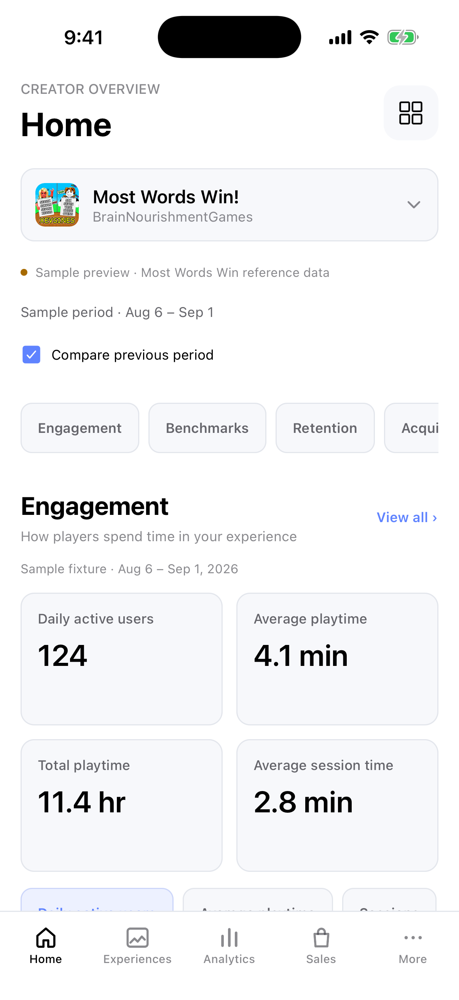
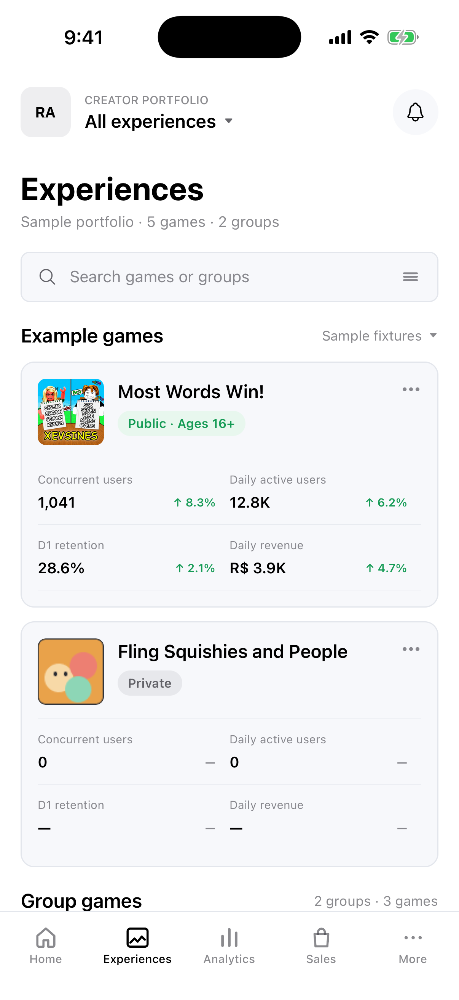
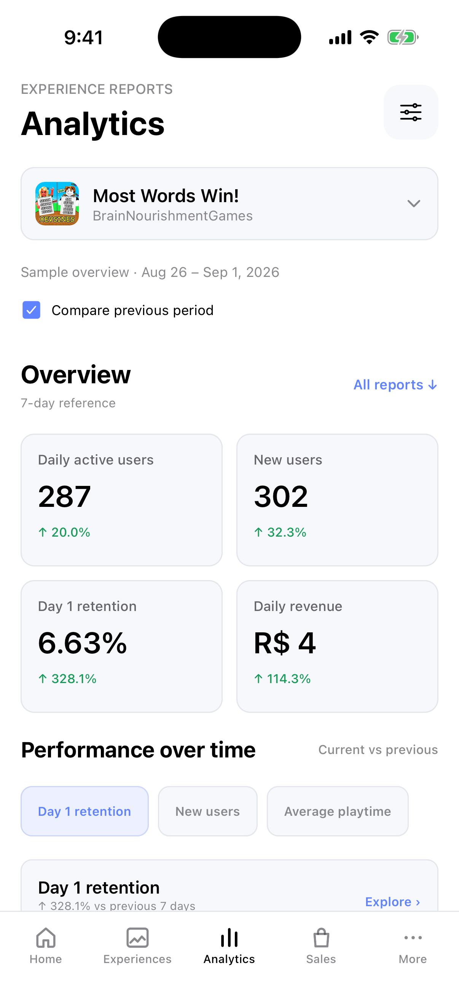
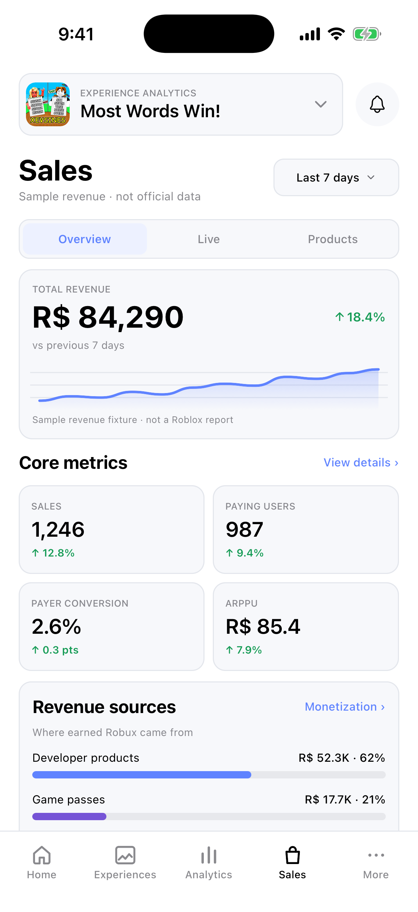
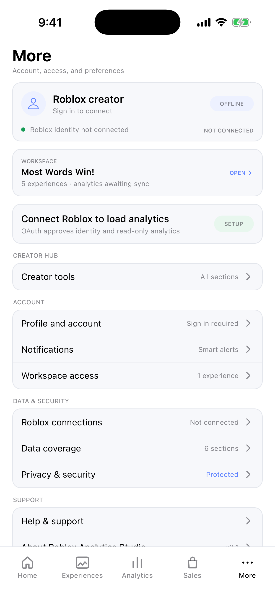

# Roblox Analytics Studio

An iOS analytics workspace for Roblox creators. The Expo/React Native app presents engagement, retention, acquisition, and aggregate monetization reports for experiences authorized through Roblox OAuth. A TypeScript AWS backend keeps delegated credentials off the device, queries Roblox asynchronously, and serves cached, tenant-scoped snapshots. The five destinations are Home, Experiences, Analytics, Sales, and More.

This is an independent, unofficial development portfolio project, not
affiliated with or endorsed by Roblox and not a production service or App
Store release. The repository retains the compatibility-sensitive
`roblox-analytics-mobile` identifiers.

## Screenshots

These iPhone 17 Pro simulator captures use offline Sample Mode. Every displayed metric is a local fixture, not a live Roblox result.

| Home | Experiences | Analytics | Sales | More |
| --- | --- | --- | --- | --- |
|  |  |  |  |  |

## Where to inspect the engineering

- [Mobile session control](services/session-controller.ts) rejects late sign-in
  results after logout or cancellation; [its tests](tests/session-controller.test.ts)
  exercise those races. The [OAuth exchange](services/roblox-auth-core.ts)
  additionally binds callbacks to the initiating app.
- [Backend authorization tests](backend/tests/analytics-authorization.test.mjs)
  exercise cross-account and concrete-universe grants before analytics are
  returned. The [worker](backend/src/lambda/analytics-worker.ts) rechecks access
  before publishing queued results.
- The [live connection incident](docs/LIVE_CONNECTION_FIX_2026-09-10.md)
  traces a real DynamoDB read-throttling failure from observed metrics to a
  bounded repair, with the remaining infrastructure reconciliation stated
  explicitly.

## Try the offline demo

On macOS with Xcode, an iPhone simulator, and Node.js 22.18 or newer:

```sh
npm ci
npm run demo
```

Choose **Explore sample data** if onboarding appears. The demo wrapper forces Sample Mode and ignores local `.env.local`; no Roblox account, AWS credentials, or paid service is needed. Expo Go must match Expo SDK 54. To avoid relying on Expo Go, run `npm run demo:build:ios`, select an iPhone simulator, and launch the standalone Release app. It embeds its JavaScript bundle and subsequently runs without Metro. `npm run demo:export` creates a JavaScript export, not an installable iPhone app.

The [reviewer guide](docs/REVIEWER_GUIDE.md) has a three-minute walkthrough. The [release checklist](docs/RELEASE_CHECKLIST.md) records what is verified and what remains open.

## How the live path works

The app requests Roblox identity and read-only `universe.analytics:read` permission through OAuth. The initiating app binds the callback to a local S256 proof and exchanges it once for an opaque app session. The device stores only that session through SecureStore. Delegated Roblox tokens are encrypted server-side with KMS; neither a Roblox API key nor a `.ROBLOSECURITY` cookie is requested by the app.

The API validates the session and the creator's concrete universe grant before reading snapshots or enqueueing a refresh. An SQS worker calls Roblox Analytics Query and verifies authorization again before publishing tenant-scoped DynamoDB data. Screens never call Roblox while rendering. Connected-mode failures do not silently substitute sample figures; missing, zero, stale, and failed reports remain distinct states.

This separation addresses three concrete problems:

- OAuth callbacks and async Keychain writes can race with cancellation or logout. Shared sign-in control, one-time exchange, and stale-result rejection prevent a late operation from reviving a signed-out account.
- Roblox analytics queries may be slow or unavailable. Queued refreshes keep the mobile UI responsive while snapshots expose freshness and source.
- A creator must not read another creator's universe. Authorization is derived from the verified session and checked at enqueue, worker execution, and transactional publication—not from a universe ID supplied by a screen alone.

The [architecture](architecture.md), [implementation map](implementation.md), and [API contract](docs/API_CONTRACT.md) show the modules and boundaries. The [live connection incident](docs/LIVE_CONNECTION_FIX_2026-09-10.md) documents how CloudWatch read throttles exposed an undersized DynamoDB table, the bounded capacity change, and the remaining deployment reconciliation.

## Verify the code

```sh
npm run verify
npm --prefix infrastructure test
npm audit --audit-level=moderate
```

`verify` runs TypeScript, lint, mobile tests, and backend tests. The infrastructure suite has a CDK stack assertion. Tests include callback correlation, duplicate sign-in, logout races, cross-tenant access, revoked worker jobs, time budgets, and stale-data behavior. Local checks are necessary but do not certify a physical device, accessibility, load capacity, cloud recovery, or public distribution.

Live development mode requires `EXPO_PUBLIC_DATA_MODE=aws_dev` and a public HTTPS `EXPO_PUBLIC_API_BASE_URL`; use the normal Expo commands rather than the sample-forcing demo wrapper. Do not put secrets into Expo environment files.

## Supported boundaries

The current connection supplies aggregate analytics for authorized experiences. Exact individual purchases, sale alerts, product rankings, and some Creator Hub reports require separate signed instrumentation or are unavailable. Simulator screenshots are not physical-device evidence. The release checklist tracks asset redistribution rights, security scans, native lifecycle checks, CI, and delivery gates before any public install claim.
