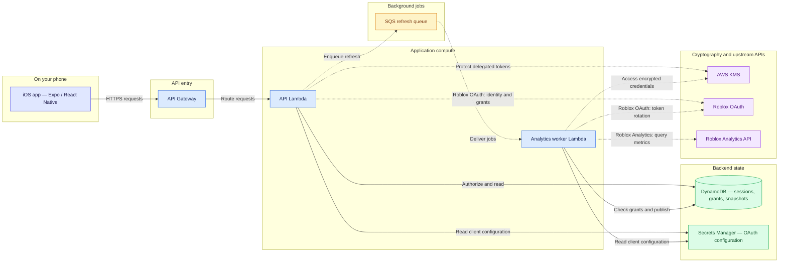
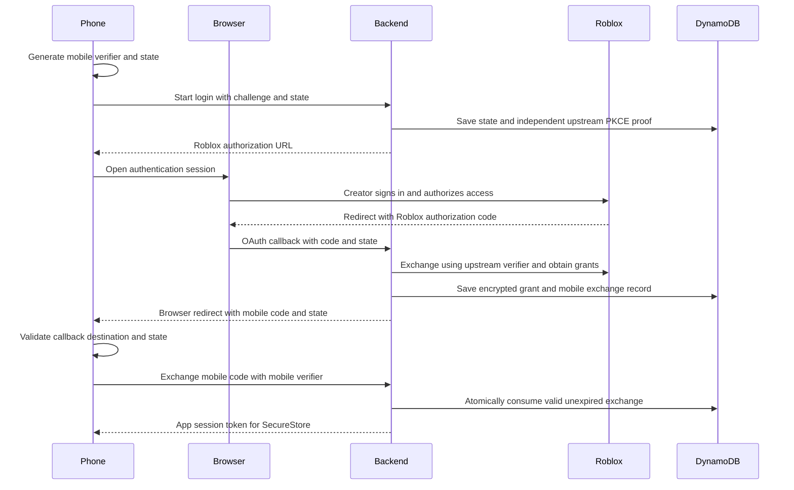
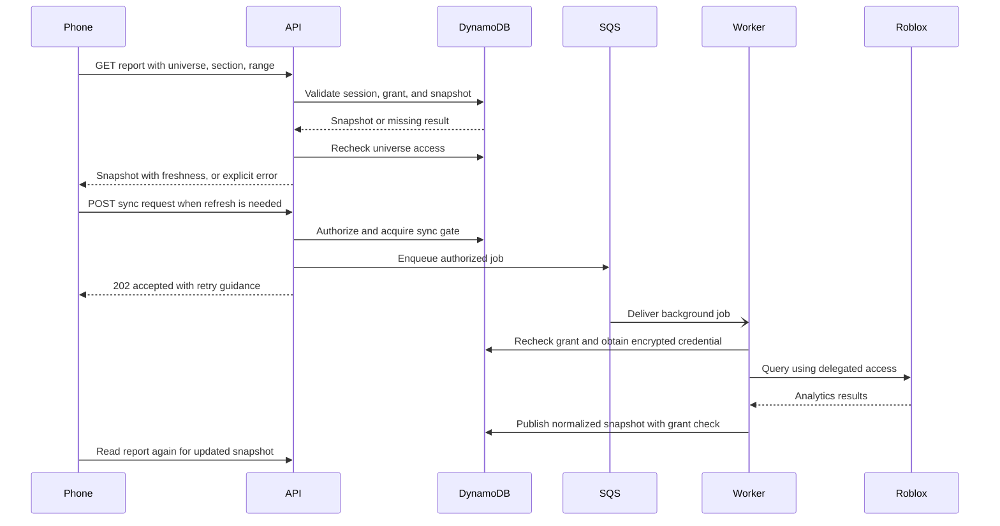

# Roblox Analytics Studio — Architecture

Current source architecture, reviewed September 10, 2026. The application is pre-release and iOS-focused. This describes the implemented analytics path, not the larger architecture proposed in early planning notes.

## System overview

Solid arrows show the main request/storage path. Dotted arrows show queued work or supporting API calls; dotted does not mean every such call is asynchronous. Responses are omitted from this overview and shown below. Sample mode stays on the phone and uses local fixtures instead of this connected path. CDK and monitoring are discussed separately to keep this diagram readable.

The core separation is between interactive reads and upstream synchronization. A screen reads a snapshot; background work obtains a newer one. That improves independence from upstream delays but requires explicit freshness and failure states.

## Client boundaries

Screens render application state and call service abstractions; they do not hold Roblox backend credentials. Expo Router supplies navigation. Shared contracts validate responses before they reach report components.

The session controller is independent of screen mounting. It owns sign-in coordination, checks operation generations, and orders secure-storage mutations. The phone stores the opaque app-session token through SecureStore. It does not receive Roblox delegated access/refresh tokens or the OAuth client secret.

## Authentication sequence

Successful login path. The browser carries Roblox's authorization code to the backend; the app receives a different, one-time mobile exchange code.

The start route is `GET /v2/auth/roblox/start`; Roblox returns through `/v1/auth/roblox/callback`; mobile redemption uses `POST /v2/auth/session/exchange`. Credential encryption uses KMS as shown in the system overview. Invalid proof, callback mismatch, or an expired/consumed code must not create a session.

State correlation, proof of verifier possession, and one-time consumption protect different parts of the flow. None replaces resource authorization on subsequent requests. Legacy v1 start/exchange endpoints return HTTP 410 rather than permitting a code-only fallback.

Implementation: `services/roblox-auth-core.ts`, `services/roblox-auth-proof.ts`, and `backend/src/modules/auth/`.

## Analytics read and refresh sequence

The screen does not wait for a Roblox query to finish. A refresh acceptance is not a completed report.

Worker credential decryption, leased token rotation when needed, and upstream polling are summarized here rather than expanded into every network call. Unauthorized requests stop before a snapshot is returned or a refresh is queued. Worker failure is not success: the phone retains an honest stale/unavailable state rather than receiving fabricated metrics.

The snapshot identity includes owner, universe, section, and range. This separates both tenant access and report contexts.

## Implemented route groups

| Route group | Purpose |
| --- | --- |
| `/v2/auth/roblox/start`, `/v1/auth/roblox/callback`, `/v2/auth/session/exchange` | Secure browser login and mobile handoff |
| `/v1/auth/session`, `/v1/auth/logout`, `/v1/auth/logout-all` | Session validation and revocation |
| `GET /v1/analytics/{section}` | Authorized section/range snapshot reads |
| `POST /v1/sync-jobs` | Authorized refresh requests |
| `GET /v1/connections` | Authorized, non-secret connection metadata |
| `GET /v1/health`, `GET /v1/sample/home` | Health check and explicit sample endpoint |

The credential-submission route `/v1/connections/analytics/validate` is scaffolded and disabled in AWS. Dedicated Home, experience-list, and Sales routes listed in older plans must not be assumed implemented: current source routes are in `backend/src/router.ts` and `backend/src/modules/analytics/routes.ts`.

## Security boundaries

- **Identity:** validate the opaque app session before exposing account data.
- **Authorization:** require the concrete creator-to-universe grant for reads, queued work, credential access, and publication.
- **Credential storage:** delegated tokens are KMS-encrypted with a subject-bound context. Platform OAuth configuration is backend-only.
- **Revocation:** account-wide session generations invalidate older sessions/exchanges; refresh tokens rotate under a conditional lease.
- **Concurrency:** stale mobile results cannot overwrite a newer account action; secure-storage operations are serialized.
- **Operational protection:** login limiting and bounded upstream deadlines fail explicitly rather than granting access when dependencies fail.
- **Data minimization:** no `.ROBLOSECURITY` cookie is requested, and aggregate analytics must not be represented as a player-level purchase history.

Encryption is not authorization. Successful login is not a universal resource grant. Passing security tests is not independent security certification.

## Infrastructure and reliability

The CDK stack defines the API Lambda, analytics worker, application table, synchronization queue and dead-letter queue, KMS key, secret containers, history bucket, and monitoring/cost controls. A resource definition does not prove its full data path is used or its configuration currently deployed. In particular, the history bucket is not evidence of a completed historical event lake.

The current table source uses on-demand billing with caps of 100 read and 25 write request units per second. The September 10 live incident traced HTTP 503 responses to the development table's earlier one-read/one-write provisioning. A targeted table update restored affected report reads, but deployed CloudFormation configuration still needed reconciliation with source at that checkpoint.

Reference: [live connection repair](docs/LIVE_CONNECTION_FIX_2026-09-10.md).

## Tradeoffs and non-goals

| Decision | Benefit | Cost or limit |
| --- | --- | --- |
| Snapshot reads + queued refresh | Decouples screen latency from upstream analytics work | Eventual consistency, freshness UI, queue coordination |
| Expo React Native + TypeScript | Shared implementation language and native mobile UI | Native-module/runtime compatibility still needs device testing |
| Serverless API + DynamoDB | Small operational footprint for the implemented access patterns | Capacity limits, IAM, and deployed configuration still matter |
| Independent offline sample path | App can be explored without an account or backend | Fixtures need unmistakable labeling and cannot prove live capabilities |
| Aggregate analytics first | Useful reports without owning game purchase handling | Exact purchase alerts require a separate integration |

Android/web releases, a verified live receipt stream, production push delivery, and a large-scale event platform are not established deliverables. Aurora, Kinesis, Fargate, AppSync, and Cognito from historical proposals are not the current core analytics architecture. No production user-count or load-capacity claim is made.

## Validation and next steps

Regression tests cover invalid callbacks, sign-in duplication, sign-out races, cross-account universe access, and revoked grants. Simulator and build checks complement those tests; they do not substitute for physical-phone testing or live operational checks.

For commands, checkpoint results, known sample-label defects, and remaining release work, see [implementation.md](implementation.md).
