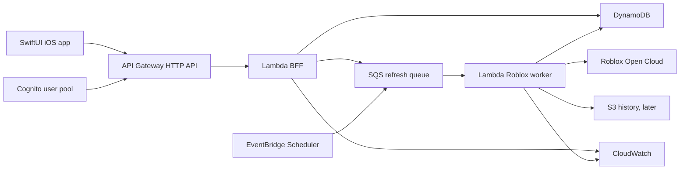

# StudioPulse AWS Backend: Free First, Scalable Later

**Status:** learning and implementation guide

**Last reviewed:** 2026-08-26

**Audience:** Fahd, building StudioPulse while learning AWS

**Product:** StudioPulse, a native iOS analytics companion for Roblox creators

## The goal

Build a backend that lets you learn AWS without creating a large bill, then grow into a reliable service without replacing the first version.

The first release should serve a small set of creators and official Roblox analytics. It should return cached snapshots quickly, refresh Roblox data in background jobs, protect Roblox credentials, and expose enough telemetry for you to understand what AWS is doing.

The design in this guide uses:

```text
SwiftUI iOS app
    -> API Gateway HTTP API
        -> Lambda backend-for-frontend
            -> DynamoDB snapshots and account state
            -> SQS refresh jobs
                -> Lambda Roblox analytics worker
                    -> Roblox Open Cloud Analytics Query API

EventBridge Scheduler starts periodic refresh work.
S3 stores historical exports after the product has real data.
Cognito authenticates StudioPulse users.
CloudWatch shows logs, metrics, and alarms.
KMS and Secrets Manager protect credentials when real connections exist.
AWS CDK defines the infrastructure in TypeScript.
```

This design matches the current repository plan: sample mode works offline, the app talks to StudioPulse rather than directly to Roblox, and the mobile client never stores a Roblox Open Cloud API key.

## The most important cost distinction

You have three different targets:

1. **Local learning:** run code, tests, fixtures, and CDK synthesis without deploying anything. This can cost $0.
2. **A small AWS sandbox:** deploy a few serverless resources inside the applicable free allowances and monitor the account closely.
3. **A production beta:** accept that security, authentication, data retention, traffic, and background jobs may create a bill.

AWS can make the first two targets inexpensive. AWS cannot promise that a real multi-tenant product remains free as usage grows. Your architecture should keep the bill predictable rather than chase a permanent $0 claim.

As of 2026-08-26, AWS advertises up to $200 in credits for a new Free Tier account: $100 at sign-up and up to another $100 through eligible activities. AWS says the free plan ends after six months or when the credits run out, whichever comes first. Credits expire twelve months after account creation. Confirm your own account plan and credit expiry inside Billing because eligibility depends on your account status.

The free plan also has an important behavior: after the free plan ends, AWS closes the account and access to its resources and data unless you upgrade to the paid plan. Treat the free plan as a learning environment, not as the permanent home of production data.

## What you should build first

### First vertical slice

Start with one read-only API path:

```text
GET /v1/health
GET /v1/me
GET /v1/experiences/{universeId}/home
```

The first real-data endpoint can return a cached fixture or a manually inserted snapshot. It should not call Roblox during a screen render. That separation teaches you the core AWS ideas without making your first deployment depend on OAuth, Roblox scopes, or a long-running analytics query.

The first milestone should include:

- Lambda handler with strict TypeScript types.
- API Gateway HTTP API route.
- DynamoDB table with a simple tenant-aware key design.
- Cognito user pool for development sign-in, or a temporary local JWT fixture.
- SQS queue and dead-letter queue for refresh work.
- EventBridge Scheduler rule that invokes the refresh entry point on a low frequency.
- CloudWatch logs with a short retention period.
- CDK stack that can synthesize and deploy the resources repeatedly.
- Unit tests for success, validation failure, throttling, retries, and secret redaction.

Delay the Roblox connection until this path works with deterministic sample data. That keeps the learning loop short and gives you a working backend before external authentication and API behavior enter the picture.

## Why this AWS stack fits StudioPulse

| AWS feature | What it teaches | StudioPulse job | Start now? |
| --- | --- | --- | --- |
| IAM | Identity and permissions | Controls who or what can call AWS | Yes, before resources |
| IAM Identity Center | Short-lived developer access | Lets you use the CLI without long-lived keys | Yes, if available for your plan |
| AWS Budgets | Cost control | Alerts you before spending grows | Yes, before deployment |
| AWS CDK | Infrastructure as code | Defines the backend in TypeScript | Yes, locally |
| CloudFormation | Repeatable provisioning | Applies CDK output and rolls back failed changes | Learn through CDK |
| API Gateway HTTP API | HTTP routing and authorization | Mobile-facing API | Yes |
| Lambda | Serverless compute | BFF and worker functions | Yes |
| DynamoDB | Key-value and document access | Users, experiences, snapshots, sync state | Yes |
| SQS | Durable work queue | Roblox refresh jobs and retries | Yes |
| EventBridge Scheduler | Time-based automation | Starts scheduled refreshes | Yes, at low frequency |
| Cognito User Pools | User authentication and JWTs | StudioPulse sessions | Learn with local users first |
| S3 | Object storage | Historical exports and reports | Later |
| Secrets Manager | Secret storage and rotation | Platform secrets and temporary credentials | Only when real secrets exist |
| KMS | Encryption key management | Protects persistent Roblox credentials | When persistent credentials exist |
| CloudWatch | Logs, metrics, alarms | Operational feedback | Yes |
| WAF | Web request filtering | Protects public endpoints at higher risk | Later |
| X-Ray or OpenTelemetry | Distributed tracing | Finds slow cross-service requests | Later |

This list gives you a useful AWS survey without asking you to learn EC2, Kubernetes, VPC routing, relational databases, streaming platforms, or every AWS product at once.

## The recommended architecture



### Request path

1. The iOS app sends a request to API Gateway.
2. API Gateway checks the StudioPulse JWT through a Cognito authorizer.
3. Lambda validates the route parameters and the workspace claim.
4. Lambda reads a normalized snapshot from DynamoDB.
5. Lambda returns the snapshot with `source`, `retrievedAt`, `lastSuccessfulSyncAt`, and `freshness` fields.
6. If the snapshot is stale, Lambda writes one deduplicated refresh request to SQS.
7. The mobile screen receives data immediately. The worker updates the snapshot later.

### Refresh path

1. EventBridge Scheduler starts a periodic refresh message or a dispatcher Lambda.
2. The dispatcher creates one job per authorized universe, subject to a rate limit.
3. SQS holds jobs until a worker can process them.
4. The worker retrieves the tenant's Roblox credential from the approved secret boundary.
5. The worker calls Roblox Open Cloud with the least-privilege analytics scope.
6. If Roblox returns a long-running operation, the worker polls with bounded backoff.
7. The worker converts the response into a canonical metric snapshot.
8. The worker writes the snapshot conditionally, records the sync result, and deletes the message.
9. Failed messages move to a dead-letter queue after a bounded retry count.

### Why the mobile app should not call Roblox

The app cannot safely hold a Roblox Open Cloud API key. If the app called Roblox directly, you would expose the credential to device storage, app inspection, logs, and network tooling. The backend gives you one controlled place to validate access, cache results, limit requests, redact errors, and rotate credentials.

## AWS account setup before building

Complete this checklist in the AWS console before deploying application resources.

### 1. Protect the root user

- Enable MFA on the AWS account root user.
- Do not create root-user access keys.
- Store the root password and recovery information in a password manager.
- Use the root user only for tasks that specifically require it.

AWS recommends MFA for the root user and recommends temporary credentials for daily work. Create an administrative identity for normal console and CLI work.

### 2. Choose a single region

Pick one region for the learning environment and keep every regional resource there. `us-east-2` is a reasonable choice if you want a nearby US region from Chicago, but the exact choice is yours. The important rule is consistency.

Write the choice in a local environment file that Git ignores:

```text
AWS_REGION=us-east-2
STUDIOPULSE_ENV=dev
```

Do not put credentials in this file. The region and environment are configuration, not secrets.

Using one region helps you learn resource discovery, reduce cross-region transfer, and avoid accidentally leaving test resources in several places.

### 3. Set up developer access

Use IAM Identity Center or another temporary-credential flow for the AWS CLI. Avoid putting long-lived access keys in the repository, shell history, screenshots, or CI settings.

The learning command sequence should eventually look like:

```powershell
aws configure sso
aws sso login --profile studiopulse-dev
$env:AWS_PROFILE = "studiopulse-dev"
aws sts get-caller-identity
```

The final command should show the account and role you expect. If it shows the root user or the wrong account, stop and fix the profile before deploying.

### 4. Create a budget before deployment

Create a recurring monthly cost budget in Billing and Cost Management. Start with a small amount you can tolerate, such as `$5` or `$10`, then add alerts at:

- 50 percent actual cost
- 80 percent actual cost
- 100 percent actual cost
- 80 percent forecasted cost

AWS Budgets can track actual and forecasted cost, but billing data can arrive with a delay. A budget alert reduces surprise; it does not guarantee that a resource stops charging at the threshold.

Also turn on:

- Free Tier usage alerts.
- Cost Anomaly Detection when the account exposes it for your plan.
- Resource tags such as `Project=StudioPulse`, `Environment=dev`, and `Owner=Fahd`.

### 5. Learn the account plan

Record these values in a private local note, not in Git:

- AWS account creation date.
- Free plan or paid plan.
- Credit balance and expiration date.
- Default region.
- Budget amount and notification email.
- Current monthly cost.

Do not put the account number in public screenshots or documentation unless you have a reason to share it.

## Cost-aware service choices

The following allowances come from AWS pricing pages reviewed on 2026-08-26. They describe current published offers, not a guarantee for every account. Check the Billing console before relying on one.

| Service | Published allowance or pricing signal | How to keep StudioPulse cheap |
| --- | --- | --- |
| AWS Free Tier | New customers can receive up to $200 in credits. The free plan lasts six months or until credits run out. | Treat credits as learning runway. Track the expiry date. |
| Lambda | 1 million requests and 400,000 GB-seconds per month in the Lambda free tier. | Keep handlers small, avoid polling loops inside long-running Lambdas, and right-size memory. |
| API Gateway HTTP API | 1 million HTTP API calls per month for up to twelve months for eligible new customers. | Use HTTP API instead of REST API unless you need a REST-only feature. |
| DynamoDB | The Standard table class free tier includes 25 WCUs, 25 RCUs, and 25 GB of storage per account/Region arrangement described by AWS. | Start with tiny provisioned capacity, small items, TTL, and narrow queries. |
| SQS | 1 million requests per month for all customers. | Batch messages and keep payloads small. Store large data in S3 later. |
| EventBridge Scheduler | 14 million invocations per month in the published free tier. | Use a small number of schedules and a dispatcher instead of one schedule per metric. |
| Cognito | Direct user-pool or social sign-in can have a 10,000 MAU free tier on Lite or Essentials. OIDC/SAML-federated users have a 50 MAU free tier, with published pricing above that threshold. | Learn with local Cognito users first. Price Roblox OIDC federation before beta. |
| KMS | AWS publishes 20,000 KMS requests per month in the free tier. A customer-managed key has a monthly storage charge. | Use one key only when persistent Roblox credentials justify it. Reuse the key. |
| Secrets Manager | AWS pricing lists a per-secret monthly charge and per-API-call charges. | Do not create secrets until you need real credentials. Cache reads inside a worker invocation. |
| S3 | S3 charges for storage, requests, retrievals, and transfer. New-account credits can apply to eligible usage. | Store compressed historical objects, apply lifecycle rules, and avoid per-request archives. |
| CloudWatch | Basic AWS service metrics are available without a separate custom-metric charge, while logs, traces, dashboards, alarms, and higher-volume observability can create charges. | Set log retention, sample traces, and avoid verbose payload logging. |

### Services to avoid in the first free learning deployment

Do not start with resources that create a fixed monthly or operational cost before you understand them:

- EC2 instances that you forget to stop.
- RDS or Aurora databases.
- NAT Gateways.
- VPC endpoints created in multiple Availability Zones.
- OpenSearch domains.
- Fargate services running continuously.
- Kinesis streams for data you do not yet have.
- AppSync real-time subscriptions.
- CloudFront, WAF, or Shield before you need their features.
- Multi-region replication.
- Customer-managed KMS keys before a real secret exists.

These services have valid uses. They do not belong in the first learning milestone for StudioPulse.

## What to learn from each AWS feature

### IAM: who can do what

IAM controls access to AWS APIs. Learn these terms:

- Principal: the user, role, service, or federated identity making a request.
- Policy: JSON that permits or denies actions.
- Action: an API operation such as `dynamodb:GetItem`.
- Resource: the specific table, queue, key, or function.
- Condition: context such as a source account, tag, or encryption context.
- Role assumption: a trusted identity receives temporary credentials.

Create separate roles for:

- CDK deployment.
- API Lambda.
- Worker Lambda.
- CI later.

The API Lambda should not decrypt Roblox credentials. The worker should not have permission to mutate unrelated AWS resources. A read-only analytics worker should not have Roblox write scopes.

### AWS CDK and CloudFormation: infrastructure as code

CDK lets you define infrastructure in TypeScript. CDK synthesizes CloudFormation templates, and CloudFormation provisions the resources as a stack.

Learn the loop:

```text
edit TypeScript
    -> npm test
    -> cdk synth
    -> inspect template and outputs
    -> cdk diff
    -> cdk deploy
    -> test the deployed endpoint
```

Keep infrastructure code in the repository. Keep values that vary by environment in context or configuration. Keep credentials out of CDK source and CloudFormation parameters.

Use one stack for the first dev environment. Split stacks only when deployment speed, ownership, or blast radius gives you a clear reason.

### Lambda: short-lived functions

Lambda runs code in response to requests and events. You pay for requests and execution duration, so it fits intermittent dashboard traffic and scheduled workers.

Learn these behaviors:

- Cold starts can make the first request slower.
- A function can run more than once when a client or event source retries.
- SQS delivery is at-least-once, so the worker must be idempotent.
- A timeout should stop work before the upstream API or queue timeout.
- Reserved concurrency can protect a downstream API from an accidental burst.
- Environment variables hold non-secret configuration, not Roblox keys.

Keep the handler thin. Put validation, business logic, and adapters in testable modules.

### API Gateway HTTP API: the public front door

API Gateway provides HTTPS routing, throttling controls, integrations, and authorization hooks.

Use it for:

- `/v1/health`
- `/v1/me`
- `/v1/experiences`
- `/v1/experiences/{universeId}/snapshots`
- `/v1/syncs/{syncId}`

Validate:

- HTTP method.
- Route parameters.
- Query limits and date windows.
- JWT claims.
- Workspace and universe authorization.
- Request body size.

Do not expose an internal worker route to the public internet. Let SQS or an internal event trigger the worker.

### Cognito: sessions for StudioPulse

Cognito User Pools can issue JWTs for the mobile app. API Gateway can validate those JWTs before invoking Lambda.

For the first learning milestone:

1. Use a development user pool.
2. Create a test user without using a real Roblox credential.
3. Validate the token issuer, audience, expiration, and subject.
4. Map the stable Cognito `sub` to a StudioPulse user record.
5. Keep the app's access and refresh tokens in iOS Keychain.

For the Roblox identity milestone, test Authorization Code + PKCE with Roblox as an OIDC provider. Roblox identity and Roblox Open Cloud analytics authorization remain separate connections. A Roblox ID token does not grant Analytics Query API access.

Current Cognito pricing makes this choice important: direct Cognito users can have a 10,000 MAU free tier on eligible tiers, while users federated through an OIDC provider have a 50 MAU free tier. Above that published OIDC allowance, AWS lists $0.015 per MAU. Validate the cost before you invite a large beta cohort.

### DynamoDB: model access patterns, not tables from habit

DynamoDB stores items identified by keys. It rewards predictable access patterns.

Start with one table and a simple design:

| Item | Partition key | Sort key | Purpose |
| --- | --- | --- | --- |
| User | `TENANT#<workspaceId>` | `USER` | Workspace owner and settings |
| Experience | `TENANT#<workspaceId>` | `EXPERIENCE#<universeId>` | Authorized universe metadata |
| Snapshot | `TENANT#<workspaceId>` | `SNAPSHOT#<universeId>#<metric>#<period>` | Cached official metric |
| Sync state | `TENANT#<workspaceId>` | `SYNC#<universeId>` | Last attempt, status, and freshness |
| Idempotency | `TENANT#<workspaceId>` | `IDEMPOTENCY#<requestId>` | Duplicate request protection |

Every read starts with a known workspace key. Never accept a workspace ID from the client as proof of access. Derive the authenticated identity from the JWT, then load the workspace membership on the server.

Use:

- Conditional writes for sync locks and idempotency.
- TTL for temporary locks and short-lived job state.
- Small items rather than one giant dashboard document.
- Query operations over scans.
- Projection expressions when you need only a few attributes.
- Explicit pagination for experience and snapshot lists.

Use S3 for large historical exports. Do not put years of raw responses into a single DynamoDB item.

### SQS: slow down and retry safely

SQS separates mobile requests from Roblox refresh work. That gives you a buffer when many tenants need data at the same time.

Every message should include a small job descriptor:

```json
{
  "jobType": "refresh-metric-snapshot",
  "workspaceId": "workspace-id",
  "universeId": "universe-id",
  "metricIds": ["DailyActiveUsers", "ForwardD1Retention"],
  "requestedAt": "2026-08-26T00:00:00Z",
  "dedupeKey": "workspace-id/universe-id/2026-08-26"
}
```

Do not put API keys, access tokens, or large API responses in the message.

Configure:

- Visibility timeout longer than the worker's maximum execution time.
- Maximum receive count.
- A dead-letter queue.
- Batch size that respects Roblox rate limits.
- A worker timeout shorter than the visibility timeout.

The worker must tolerate duplicate delivery. A job can safely run twice without creating two snapshots for the same query window.

### EventBridge Scheduler: schedule work, not traffic

Use one or a few schedules to start a dispatcher. The dispatcher can select due sync records and enqueue bounded batches.

Avoid creating a separate schedule for every metric or every user during the first design. A large schedule count makes the system harder to inspect and can create unnecessary operational noise.

Set retry limits and a dead-letter destination for scheduled targets. Give every scheduled task an owner and a reason for existing.

### S3: historical objects and reports

Add S3 after DynamoDB snapshots work. Store objects by tenant and date:

```text
s3://<private-bucket>/workspace=<workspaceId>/universe=<universeId>/date=2026-08-26/query=<queryId>.json.gz
```

Use:

- Block Public Access.
- Server-side encryption.
- Lifecycle expiration for development data.
- Versioning only when you can justify its storage cost.
- Compressed JSON for early audit snapshots.
- Parquet and Athena only when historical analysis justifies them.

Do not serve a private bucket directly to the iOS app. Let the backend authorize access, or issue a short-lived signed URL for a specific artifact.

### Secrets Manager and KMS: protect real credentials

The first sample-data deployment needs no real Roblox API key. Do not create a production secret just to test a button.

When you add real Roblox analytics access:

1. Create a dedicated Roblox key with `universe.analytics:read` only.
2. Restrict it to the selected universe or universes.
3. Restrict it to the worker's fixed egress only if the network design supports that requirement.
4. Set an expiry and build a rotation reminder.
5. Store the key in Secrets Manager or an equivalent approved secret store.
6. Use KMS encryption with an encryption context that includes the workspace ID when persistent tenant credentials require it.
7. Allow only the worker role to read or decrypt the credential.
8. Redact the value from logs, errors, snapshots, and test output.

A customer-managed KMS key creates a monthly storage charge. That cost belongs in the security budget once you store real tenant credentials. Do not weaken credential protection to preserve a $0 target.

Never use `.ROBLOSECURITY` for StudioPulse. Never ship a Roblox Open Cloud key in the iOS application.

### CloudWatch: learn from the system

Start with structured logs containing:

- `requestId`
- `workspaceId` only when a tenant-safe identifier is useful
- `universeId` when the user authorized that context
- `route`
- `operation`
- `status`
- `durationMs`
- `retryCount`
- `source`

Do not log:

- Authorization headers.
- JWT contents.
- Roblox API keys.
- OAuth client secrets.
- Full webhook bodies.
- Raw player profiles.
- Unnecessary personal data.

Set log retention for development instead of keeping indefinite logs. Add alarms for:

- Lambda errors.
- Lambda throttles.
- API Gateway 5xx responses.
- SQS age of oldest message.
- Dead-letter queue messages.
- Roblox 401/403 responses.
- Roblox 429 responses.
- Sync failures per workspace.

## The StudioPulse data contract

The backend should return a stable domain shape so the iOS UI does not depend on AWS or Roblox response formats.

Example snapshot shape:

```json
{
  "experienceId": "universe-id",
  "metric": "DailyActiveUsers",
  "period": {
    "start": "2026-08-01T00:00:00Z",
    "end": "2026-08-26T00:00:00Z",
    "granularity": "OneDay"
  },
  "points": [
    {
      "start": "2026-08-25T00:00:00Z",
      "end": "2026-08-26T00:00:00Z",
      "value": 1234,
      "status": "Observed"
    }
  ],
  "source": "Roblox Analytics Query API",
  "retrievedAt": "2026-08-26T12:00:00Z",
  "lastSuccessfulSyncAt": "2026-08-26T12:00:00Z",
  "freshness": "Fresh",
  "queryId": "redacted-or-internal-id"
}
```

The domain model should represent:

- `Fresh` data.
- `Stale` data.
- `Sparse` data.
- `NoData`.
- `Projected` data.
- `NotStatisticallySignificant` data.
- `SourceError`.
- `Unauthorized`.

The app should show the freshness and source state. It should not imply that a cached Roblox aggregate is a live purchase feed.

## Roblox connector design

The Roblox worker should own the external API behavior. Keep that adapter separate from API route code.

### Connector responsibilities

- Accept an explicit universe ID.
- Validate the metric and granularity combination.
- Use UTC windows with an inclusive start and exclusive end.
- Send the API key only in the `x-api-key` header.
- Handle `200` success responses.
- Handle `202` long-running operations and poll the returned operation path.
- Handle `400` validation errors without retrying unchanged input.
- Handle `401` and `403` as credential or scope findings.
- Handle `404` as a target or endpoint mismatch.
- Handle `429`, `500`, `503`, and `504` with bounded exponential backoff and jitter.
- Preserve query provenance without preserving credentials.
- Normalize source status and data-quality warnings.

### Retry policy example

```text
Attempt 1: immediate
Attempt 2: 1 second + jitter
Attempt 3: 2 seconds + jitter
Attempt 4: 4 seconds + jitter
Stop after the configured limit
```

Do not retry a malformed query forever. Do not retry a revoked credential forever. Do not allow one tenant's failing key to consume all worker concurrency.

### Rate limiting

Queue work per API-key owner or workspace. Add a token bucket or bounded dispatcher before the worker creates high traffic. Stagger tenant refreshes. Cache results so opening the same screen does not create a new Roblox query.

Roblox analytics queries can return long-running operations and have metric/dimension-specific limits. Recheck official Roblox documentation before implementing a new metric family.

## A four-phase learning and delivery plan

### Phase 0: local only

**Cost target:** $0

Learn:

- TypeScript modules.
- Lambda handler shape.
- API request validation.
- DynamoDB access patterns through mocks or local fixtures.
- SQS message handling.
- CDK constructs and `cdk synth`.
- Unit tests and secret-redaction tests.

Build:

```text
backend/
  src/
    functions/health.ts
    functions/home.ts
    workers/refreshMetrics.ts
    domain/
    adapters/
    validation/
  test/
infra/
  bin/
  lib/
```

Keep sample repositories usable without network access. A test should prove that a screen can render from a fixture when AWS and Roblox are unavailable.

### Phase 1: AWS sandbox

**Cost target:** within your account's free allowances

Deploy:

- One CDK stack.
- One API Gateway HTTP API.
- One health Lambda.
- One DynamoDB table.
- One SQS queue and DLQ.
- One CloudWatch log group with retention.
- One low-frequency scheduler.

Do not connect Roblox credentials yet. Insert a non-sensitive fixture snapshot through a developer-only seed command or a CDK custom resource only if you understand its lifecycle. A local fixture endpoint is safer for the first UI connection.

Verify:

- `aws sts get-caller-identity` uses the intended role.
- `cdk diff` shows only expected resources.
- API Gateway returns the health response.
- Lambda logs contain no secrets.
- DynamoDB reads use a known key.
- A message reaches SQS and is processed once.
- A failed message reaches the DLQ.
- The budget and Free Tier dashboards show the expected usage.

### Phase 2: authenticated read-only beta

**Cost target:** small, measured monthly spend

Add:

- Cognito development user pool.
- API Gateway JWT authorization.
- User and workspace records.
- Experience authorization records.
- Separate Roblox analytics credential.
- Worker-only secret access.
- Real read-only Analytics Query API calls.
- Scheduled refresh with a conservative cadence.
- Stale-data and no-data UI states.

Keep the beta small. Invite a few creators, measure request counts and sync volume, then update the cost model before adding more experiences or a higher refresh rate.

### Phase 3: production hardening

Add only after the beta identifies a need:

- Separate staging and production accounts or environments.
- CI/CD with GitHub Actions and AWS OIDC.
- S3 historical snapshots.
- Key rotation workflow.
- Per-tenant and per-IP throttles.
- More detailed CloudWatch metrics.
- WAF for a public high-risk API.
- Backup and restore testing.
- Incident runbook.
- Data deletion and tenant offboarding.

Be careful with AWS Organizations while using a new Free Tier account. AWS documents that joining an Organization can end free-plan benefits and upgrade the account to a paid plan. Make that move only after you understand the billing consequence.

### Phase 4: measured scaling

Move to the next capacity strategy when measurements justify it:

| Signal | First response | Later option |
| --- | --- | --- |
| API requests increase | Cache snapshots and add API throttles | More Lambda concurrency and regional strategy |
| Worker backlog grows | Batch SQS messages and stagger schedules | More worker concurrency with downstream limits |
| DynamoDB throttles | Inspect hot keys and query shape | Auto scaling or on-demand capacity |
| Snapshot history grows | Add S3 lifecycle rules | Parquet, Glue, and Athena for analysis |
| Authentication cost grows | Measure MAU and provider mix | Revisit federation and account structure |
| Roblox rate limits appear | Reduce refresh frequency and cache | Per-tenant quotas and dedicated worker pools |
| Relational queries become necessary | Keep BFF contract stable | Evaluate Aurora only with measured need |
| Real-time updates become valuable | Start with polling or push batching | Evaluate AppSync or another channel |

Registered-user count alone should not trigger Aurora, Kinesis, ECS, AppSync, or a multi-region deployment.

## Scaling without rewriting the app

### Keep the API contract stable

The iOS app should know about `Experience`, `MetricSnapshot`, `Freshness`, and `SyncStatus`. It should not know whether the backend uses DynamoDB, Aurora, S3, or a cache.

Define protocols in the backend:

```text
SnapshotRepository
ExperienceRepository
CredentialProvider
RobloxAnalyticsClient
RefreshQueue
Clock
IdempotencyStore
```

The first implementation can use DynamoDB adapters. A later adapter can read from another store without changing the view model or route contract.

### Separate control plane from data plane

StudioPulse has two kinds of work:

- **Control plane:** users, workspaces, experience selections, credentials, preferences, and sync state.
- **Data plane:** metric snapshots, historical exports, reports, and optional future game telemetry.

The control plane needs strong tenant authorization and small, current records. The data plane needs batching, retention, and storage economics. Keeping them separate lets you scale historical data without making account requests more expensive.

### Keep official analytics separate from game telemetry

Roblox Analytics Query API returns aggregated platform analytics. It does not give StudioPulse a raw player-event warehouse. If a creator needs a game-specific question, add a small server-authoritative event schema in the Roblox experience and send approved summaries through a separate ingestion design.

Do not add Kinesis, Firehose, or a large event lake until you have a measured event volume and a clear question that official aggregates cannot answer.

## Security model

### Credential boundaries

| Credential | Lives in | Used by | Never put in |
| --- | --- | --- | --- |
| AWS developer session | IAM Identity Center or temporary role | Local CLI and CDK | Git, app bundle, screenshots |
| StudioPulse access token | iOS Keychain | iOS app | Logs or analytics snapshots |
| Roblox Open Cloud key | Secrets Manager/KMS boundary | Roblox worker only | iOS app, Git, chat, DynamoDB plaintext |
| Roblox OAuth client secret | Backend secret store | OAuth callback/token exchange | iOS app or public repository |
| Webhook secret, if added | Secrets Manager | Webhook verifier | Logs or request records |

### Tenant isolation

Every request must follow this sequence:

1. Validate the JWT signature and standard claims.
2. Resolve the stable StudioPulse user ID.
3. Load the user's workspace membership.
4. Confirm the requested universe belongs to that workspace.
5. Read or write only through a repository method that requires the authorized workspace context.
6. Record a redacted operation result.

Do not accept `workspaceId` or `universeId` from a client request as authorization. Treat both values as selectors that still need a server-side membership check.

### Roblox scope policy

Start with `universe.analytics:read`. Add a separate optional scope only when a named feature requires it. Do not attach asset-write, publish, messaging, DataStore-write, moderation, or server-restart permissions to the analytics credential.

Roblox OAuth verifies identity. The Open Cloud API key supplies analytics access. Keep those connections separate in the data model and the UI.

### Data minimization

Store aggregate analytics and the minimum account metadata needed to serve the product. Avoid storing player-level data, purchaser identity, unrestricted DataStore profiles, or raw webhook bodies when a redacted event summary is enough.

Define retention before production:

- Development logs: 7 days.
- Failed-job metadata: 14 to 30 days.
- Dashboard snapshots: enough history for the product, with a documented limit.
- Raw external responses: only when you need auditability, compressed and expired by lifecycle policy.

## Testing plan

### Local unit tests

Test these without AWS or Roblox:

- JWT claim mapping with valid and invalid claims.
- Workspace authorization.
- Metric query validation.
- UTC start/end handling.
- Snapshot normalization.
- Freshness classification.
- `202` operation polling.
- `429` backoff.
- `401` and `403` credential findings.
- SQS duplicate delivery.
- Idempotent snapshot writes.
- Dead-letter decisions.
- Secret redaction from errors and logs.
- DynamoDB key construction.

### Integration tests

Run these in a disposable AWS environment:

- API Gateway to Lambda.
- Lambda to DynamoDB.
- EventBridge to SQS.
- SQS to worker Lambda.
- Worker failure to DLQ.
- Cognito JWT to API Gateway authorization.
- CloudWatch alarms on a controlled failure.

Use a dedicated development account or stack. Do not point tests at production credentials or production universes.

### Contract tests

Keep an OpenAPI 3.1 document. Verify that:

- Swift models match response shapes.
- Error envelopes remain stable.
- New optional fields do not break old clients.
- Pagination and freshness states remain explicit.
- Sample fixtures satisfy the same schema as live data.

## A practical CDK workflow

The commands below describe the intended workflow. Do not run deployment commands until the account budget and developer identity are ready.

```powershell
# From the infrastructure directory
npm ci
npm test
npx cdk synth
npx cdk diff
npx cdk deploy StudioPulseDevStack
```

After deployment:

```powershell
aws cloudformation describe-stacks `
  --stack-name StudioPulseDevStack `
  --region $env:AWS_REGION `
  --profile studiopulse-dev

aws logs tail /aws/lambda/studiopulse-dev-api `
  --since 10m `
  --region $env:AWS_REGION `
  --profile studiopulse-dev
```

Use the exact function and stack names emitted by the CDK outputs. Do not guess resource names in scripts.

Before removing a stack, inspect its resources and any retained S3 data. Keep deletion commands out of unattended automation.

## Learning curriculum

### Week 1: cloud fundamentals and account safety

Learn:

- Regions and Availability Zones.
- IAM users, roles, policies, and temporary credentials.
- Billing, budgets, tags, and free-tier tracking.
- Shared responsibility for security.
- What AWS managed services do for you.

Practice:

- Secure root MFA.
- Use a non-root developer identity.
- Run `aws sts get-caller-identity`.
- Create and inspect a budget.
- Read a CloudFormation template without deploying it.

### Week 2: serverless request path

Learn:

- API Gateway routes.
- Lambda invocation and timeouts.
- JSON validation.
- CloudWatch logs.
- Error responses and correlation IDs.

Practice:

- Build `/v1/health` locally.
- Deploy one health function.
- Trigger one controlled failure.
- Find the error in CloudWatch.
- Set a log retention period.

### Week 3: DynamoDB and queues

Learn:

- Partition keys and sort keys.
- Query versus scan.
- Conditional writes.
- TTL.
- SQS visibility timeout, retries, and DLQs.

Practice:

- Store a sample experience.
- Read a snapshot by tenant and universe.
- Enqueue a refresh job.
- Make the worker fail once.
- Confirm the DLQ receives the message after the configured attempts.

### Week 4: CDK and repeatable deployments

Learn:

- CDK constructs.
- Context and environment configuration.
- CloudFormation change sets and rollback.
- `cdk synth`, `cdk diff`, and `cdk deploy`.

Practice:

- Delete and recreate the dev stack only after inspecting resources.
- Change one property and review the diff.
- Keep the infrastructure source in Git.

### Week 5: authentication and security

Learn:

- Cognito user pools.
- JWT claims.
- API Gateway JWT authorizers.
- IAM execution roles.
- Secrets Manager and KMS boundaries.

Practice:

- Authenticate a test user.
- Reject an expired token.
- Reject a user requesting another workspace.
- Confirm that the API Lambda cannot read the Roblox secret.
- Confirm that the worker can read only the intended secret.

### Week 6: real Roblox read-only integration

Learn:

- Roblox Open Cloud API keys and scopes.
- Analytics Query API metric definitions.
- UTC windows and granularity.
- `202` operation polling.
- Aggregated versus game-owned telemetry.

Practice:

- Query one explicitly authorized universe.
- Cache the normalized result.
- Show freshness in the iOS UI.
- Test an empty result and a transient upstream failure.
- Rotate or revoke the development key after the test.

## Cost review routine

Run this routine weekly during learning and before every beta expansion:

1. Check the Billing home page.
2. Check the Free Tier usage dashboard.
3. Check AWS Budgets actual and forecasted values.
4. Group cost by service and region.
5. Look for resources you did not create intentionally.
6. Check Lambda invocation and duration.
7. Check API Gateway request count and response bytes.
8. Check DynamoDB capacity and storage.
9. Check SQS request count and oldest message age.
10. Check CloudWatch log ingestion and retention.
11. Check Secrets Manager secret count and KMS request count.
12. Delete disposable development resources after the experiment.

Keep a short cost note:

```text
Date:
Environment:
Monthly cost:
Free-tier usage:
Top service:
Unexpected resource:
Change made:
Next review:
```

The note teaches you how usage maps to a bill. That skill matters more than memorizing individual free-tier numbers.

## What “scalable” means for this product

For StudioPulse, scalability means:

- API requests do not require a permanently running server.
- Background sync can queue work when demand spikes.
- One tenant's Roblox failure does not block other tenants.
- The backend can add Lambda concurrency within downstream API limits.
- DynamoDB can handle the known key-based access patterns.
- Historical data can move to S3 without changing the mobile API.
- Authentication, credentials, and snapshots remain tenant-scoped.
- You can inspect errors and cost before users report them.

Scalability does not mean adding every high-scale AWS service on day one. It means making the first boundaries clean enough that you can replace one implementation behind them.

## Go-live checklist for a small beta

### Account and billing

- [ ] Root MFA enabled.
- [ ] No root access keys.
- [ ] Non-root developer access works.
- [ ] Region documented.
- [ ] Monthly budget created.
- [ ] Actual and forecast alerts configured.
- [ ] Free Tier expiry recorded.
- [ ] No unknown resources in the account.

### Backend

- [ ] CDK source is committed.
- [ ] `cdk synth` succeeds.
- [ ] `cdk diff` is reviewed before deployment.
- [ ] API Gateway routes validate inputs.
- [ ] API Gateway authorizes JWTs.
- [ ] Lambda roles use least privilege.
- [ ] DynamoDB reads use tenant-aware keys.
- [ ] SQS has a DLQ and bounded retries.
- [ ] Worker concurrency respects Roblox limits.
- [ ] Logs redact credentials and tokens.
- [ ] Log retention is configured.
- [ ] CloudWatch alarms cover errors, throttles, backlog, and DLQ messages.

### Roblox connection

- [ ] Universe ID is explicit and verified.
- [ ] Key scope is `universe.analytics:read` unless a named feature requires more.
- [ ] Key access is restricted to intended universes.
- [ ] Key value stays outside Git and iOS.
- [ ] The connector handles 202 polling.
- [ ] The connector handles 429 and transient errors.
- [ ] Empty and sparse results render honestly.
- [ ] Query provenance includes metric, window, granularity, status, and retrieval time.

### iOS

- [ ] Sample mode works with no AWS connection.
- [ ] The app reads StudioPulse snapshots rather than Roblox directly.
- [ ] Tokens use Keychain.
- [ ] The UI labels freshness and source.
- [ ] Offline and stale states are tested.
- [ ] Sign-out clears session state.

## Decisions to make before production

Write down answers to these questions before inviting a larger beta:

1. Will the first beta use Cognito local users, Roblox OIDC federation, or both?
2. How many monthly active creators do you expect in the first three months?
3. How many universes can each workspace connect?
4. How often should each universe refresh?
5. How long should snapshots and raw responses remain available?
6. Do creators need historical exports, or do current dashboard snapshots solve the first problem?
7. What exact game-owned data would official Roblox aggregates fail to answer?
8. What budget would make you pause new sign-ups?
9. What alert indicates a bad release or a broken upstream connector?
10. Which AWS service would you add only after a measured threshold?

## Official learning and reference links

Check these links again before deployment because AWS pricing and product behavior change:

- [AWS Free Tier](https://aws.amazon.com/free/)
- [AWS Free Tier FAQs](https://aws.amazon.com/free/free-tier-faqs/)
- [Choosing an AWS Free or Paid account plan](https://docs.aws.amazon.com/awsaccountbilling/latest/aboutv2/free-tier-plans.html)
- [AWS Budgets best practices](https://docs.aws.amazon.com/cost-management/latest/userguide/budgets-best-practices.html)
- [AWS root-user best practices](https://docs.aws.amazon.com/IAM/latest/UserGuide/root-user-best-practices.html)
- [AWS CDK documentation](https://docs.aws.amazon.com/cdk/)
- [AWS CDK core concepts](https://docs.aws.amazon.com/cdk/v2/guide/core-concepts.html)
- [AWS Lambda pricing](https://aws.amazon.com/lambda/pricing/)
- [Amazon API Gateway pricing](https://aws.amazon.com/api-gateway/pricing/)
- [Amazon DynamoDB pricing](https://aws.amazon.com/dynamodb/pricing/)
- [Amazon SQS pricing](https://aws.amazon.com/sqs/pricing/)
- [Amazon EventBridge pricing](https://aws.amazon.com/eventbridge/pricing/)
- [Amazon Cognito pricing](https://aws.amazon.com/cognito/pricing/)
- [Amazon S3 pricing](https://aws.amazon.com/s3/pricing/)
- [Amazon CloudWatch pricing](https://aws.amazon.com/cloudwatch/pricing/)
- [AWS KMS pricing](https://aws.amazon.com/kms/pricing/)
- [AWS Secrets Manager pricing](https://aws.amazon.com/secrets-manager/pricing/)
- [Roblox Open Cloud](https://create.roblox.com/docs/cloud)
- [Roblox API key management](https://create.roblox.com/docs/cloud/auth/api-keys)
- [Roblox Open Cloud scopes](https://create.roblox.com/docs/cloud/reference/scopes)
- [Roblox Analytics Query API](https://create.roblox.com/docs/cloud/guides/analytics)
- [Roblox supported analytics metrics](https://create.roblox.com/docs/cloud/guides/analytics/metrics)

## Final recommendation

Start locally, deploy one small CDK stack, and learn each service through one observable behavior. Use Cognito local users before paying for Roblox OIDC federation, use DynamoDB before a relational database, use SQS before streaming infrastructure, and keep Roblox credentials out of the system until the sample path works.

When traffic or product requirements grow, measure the bottleneck, update the cost model, and introduce one service at a time. That gives you AWS experience and leaves StudioPulse with a backend you can operate.
