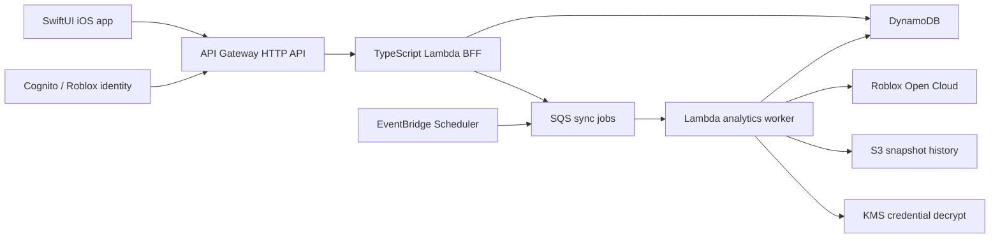

# StudioPulse Mac and iOS Development Playbook

Status: implementation plan, not production evidence  
Last updated: 2026-08-22  
Target: native iOS app, first validated on iPhone 16 geometry (393 x 852 points)  
Scale objective: free local development, low-cost beta, and a clean path to roughly 10,000 registered creator users

## 1. The decision in one page

We will build StudioPulse as a native SwiftUI app with a small AWS serverless backend. The first night is local and sample-data only. Real authentication, Roblox credentials, AWS deployment, notifications, and in-game live-sale instrumentation come later as separate, reviewable milestones.

The chosen stack is:

| Layer | Decision |
| --- | --- |
| iOS UI | SwiftUI, Observation, Swift Concurrency, Swift Charts |
| iOS networking | URLSession behind typed service protocols |
| iOS persistence | Keychain for StudioPulse session tokens; a small file/URL cache first; no database until a measured need |
| iOS project | Tuist-generated project, Swift Package Manager dependencies, CLI-first `xcodebuild` verification |
| API contract | OpenAPI 3.1, with generated or mechanically checked Swift/TypeScript models |
| Backend language | TypeScript on the current active Node.js LTS, pinned in the repository |
| Infrastructure | AWS CDK in TypeScript |
| Product API | API Gateway HTTP API + Lambda |
| Identity | Cognito user pool with a Roblox OIDC proof-of-concept; cost and compatibility must be validated before beta |
| Operational data | DynamoDB as the initial system of record and dashboard snapshot store |
| Async work | SQS + EventBridge Scheduler + Lambda workers |
| Historical snapshots | S3, introduced when real data exists |
| Credential encryption | One customer-managed KMS key for envelope encryption when persistent Roblox keys are enabled |
| Observability | Structured OSLog on iOS; bounded CloudWatch logs/metrics on AWS |
| CI | Local first; GitHub Actions with pinned tools later; AWS access through OIDC rather than long-lived CI keys |

What we are explicitly not starting with:

- Aurora or any always-on relational database
- Kinesis, Kafka, or a raw player-event lake
- Fargate, Kubernetes, EKS, or microservices
- AppSync or a permanent WebSocket layer
- Redis or ElastiCache
- NAT Gateway or fixed cloud egress before real multi-tenant credentials are accepted
- A custom Roblox in-game SDK
- Generative explanations of analytics

Those technologies can be introduced behind existing interfaces if measured traffic or product requirements justify them. Registered user count alone does not justify them.

## 2. Honest cost promise

“Free now and scalable to 10,000 users” means:

1. Local UI development, simulator testing, fixtures, and mocked networking cost $0.
2. An Apple Account is enough for Xcode, the simulator, and limited personal-device testing. Public App Store and TestFlight distribution requires the Apple Developer Program, currently 99 USD per year.
3. A new eligible AWS account can use free-plan credits and several monthly free tiers. Existing accounts may not receive the new-account credits.
4. A secure real-data beta is not literally guaranteed to cost $0. A customer-managed KMS key currently has a 1 USD monthly storage charge, and reliable fixed egress for IP-restricted Roblox API keys introduces networking cost.
5. At 10,000 registered users, the architecture scales without a platform rewrite, but active usage, connected universes, polling frequency, logs, OIDC authentication, and live events will create a bill.

Current official examples and caveats, checked on 2026-08-22:

| Service | Useful free allowance or cost fact | Design consequence |
| --- | --- | --- |
| Xcode/Apple Account | Development is free; paid membership is for distribution and advanced capabilities | Build locally before paying for distribution |
| AWS new-account plan | Up to 200 USD in credits for eligible new customers, with the free plan limited in duration | Treat credits as runway, not architecture |
| Lambda | 1 million requests and 400,000 GB-seconds monthly in its free tier | Good fit for a quiet beta API and workers |
| DynamoDB | 25 GB plus 25 provisioned read and write capacity units in the listed free tier | Use provisioned capacity in dev; switch capacity mode later without changing the data contract |
| SQS | 1 million requests monthly free | Good for sync jobs and retries |
| API Gateway | New-customer free tier includes 1 million HTTP API calls monthly for up to 12 months | Use HTTP API, not REST API, unless a missing feature requires REST |
| Cognito | Direct/social sign-in has a 10,000 MAU free tier; SAML/OIDC federation has only 50 free MAU | Roblox federation is clean but not free at 10,000 MAU; validate or reconsider before beta |
| KMS | Customer-managed key storage is 1 USD/month; 20,000 requests/month are listed in the free tier | Budget a small security floor rather than weakening credential storage |
| Tuist | Generated projects are listed as unlimited on the free individual plan | Use local project generation; do not enable remote features for the first night |

Free tiers change and are not a substitute for budgets. Before any AWS deployment, add a low monthly budget, anomaly alerts, short log retention, resource tags, and reserved Lambda concurrency. No paid resource should be created by an unattended goal.

## 3. Current repository reality

As of this document:

- Git has no commits and no remote configured.
- `StudioPulse/` contains placeholder directories only.
- `StudioPulse.xcodeproj/` does not contain `project.pbxproj`, so it is not a usable Xcode project.
- `design-system-state-studiopulse-onboarding.json` is the only substantive workspace file.
- No production app, AWS infrastructure, Roblox SDK, OAuth client, ingest endpoint, or real creator-data integration exists.

This is a greenfield implementation. The placeholder directories must be preserved and inspected, but they do not constrain the project generator.

Before moving between Windows and the MacBook, create a private remote or copy the entire folder, including `.git`. A private Git remote is preferred because it gives rollback and morning review. Do not make the repository public once credentials, bundle identifiers, internal screenshots, or product policy notes are added.

## 4. Product contract for development

### 4.1 Primary user

The first user is a serious solo Roblox creator or small-studio owner who manages one or more experiences and wants a fast mobile operating view. StudioPulse is not a mobile Roblox Studio editor and not a generic BI dashboard.

### 4.2 Stable navigation

The app has five persistent destinations:

1. Home
2. Experiences
3. Analytics
4. Sales
5. More

The selected experience is shared context across Analytics and Sales. Home begins portfolio-first, then drills into a selected universe.

### 4.3 Valid first-session story

The mandatory onboarding story is:

1. **Welcome / Sample Mode** - the creator can see the product before trusting it with anything.
2. **Roblox identity** - Authorization Code + PKCE with `openid profile` identifies the creator.
3. **Read-only analytics access** - the creator creates a dedicated Open Cloud key with `universe.analytics:read` and selected universe access.
4. **Choose experiences** - StudioPulse shows only universes authorized by that connection; the creator selects what appears in the app.
5. **Ready** - land in Home with freshness and source labels visible.

Live Sales setup is optional after activation. It must not block a creator who only wants official read-only analytics.

Important implementation truth: Roblox OAuth identity does not itself grant Analytics Query API access, and the ID token is identity proof rather than access to Roblox resources. The Open Cloud analytics key is a separate credential. There is also no documented portfolio endpoint that safely implies every universe the user can manage, so onboarding must derive choices from validated key resources or explicit universe selection rather than inventing an all-experiences discovery capability.

### 4.4 P0 real-data metrics

The first official-data vertical slice uses a deliberately small set:

- Daily Active Users
- Daily Revenue in Robux
- Forward D1 Retention
- Average playtime
- freshness, source, last successful sync, and sparse/no-data state

Payer conversion can be the next metric. The broader metric catalog belongs behind Analytics, not on the first Home screen.

### 4.5 Sales truth

The Sales tab initially shows aggregate monetization and product trends from official analytics. It is not an exact receipt ledger.

Exact “a Premium Bundle sold now” alerts require a separate opt-in game-server signal emitted after the experience's trusted purchase handler has granted the purchase. That future signal must be signed, replay-protected, deduplicated, asynchronous, and unable to affect receipt acknowledgment or gameplay. Purchaser identity is excluded by default.

## 5. Target architecture



This is one control-plane application with background jobs, not a fleet of microservices. Deployment units can be separate Lambda functions while source code remains a modular monolith.

### 5.1 Request path

1. The iOS app requests a cached Home or Analytics view.
2. API Gateway validates the StudioPulse session/JWT and invokes the BFF.
3. The BFF verifies workspace and universe authorization on every request.
4. The BFF returns a DynamoDB snapshot immediately.
5. If the snapshot is stale, the BFF enqueues one deduplicated refresh job; it does not block the mobile response on Roblox.
6. A worker decrypts the tenant key only for the call, queries Roblox, handles `202` polling, normalizes the response, stores a new snapshot, and clears the sync lock.
7. The app receives a freshness state and can refresh or observe a later update.

### 5.2 Why DynamoDB first

At this stage, the product needs users/workspaces, connections, experiences, sync state, cached metric snapshots, idempotency, and notification preferences. These access patterns are known and tenant-keyed. DynamoDB provides low idle cost, TTL, conditional writes, and a simple path from provisioned free-tier capacity to on-demand or auto-scaled capacity.

Aurora becomes justified only if product behavior proves we need complex ad hoc joins, sophisticated team/report queries, or transactional workflows that are materially awkward in DynamoDB. Adding Aurora later does not change the iOS contract if the BFF and OpenAPI boundary remain stable.

### 5.3 Why TypeScript on the backend

- AWS CDK and AWS SDK support are first-class.
- Runtime validation and OpenAPI tooling are mature.
- The Roblox connector is HTTP/JSON work rather than CPU-heavy processing.
- It separates mobile code from secret-bearing server code clearly.
- It is easier to hire for than a Swift-only AWS backend if StudioPulse grows.

The backend should use strict TypeScript, runtime schema validation, small modules, and AWS Lambda Powertools or equivalent structured telemetry. A web framework is optional; do not add one until routing complexity benefits from it.

## 6. iOS architecture

### 6.1 Pattern

Use a feature-first, unidirectional state model built from Apple-native primitives:

- `@Observable` feature models on the main actor
- immutable value models for API and display data
- protocols for repositories, clocks, UUID generation, and persistence
- async functions and `AsyncSequence` where streaming state is genuinely useful
- environment injection at feature boundaries
- explicit loading, loaded, empty, sparse, stale, and failed states

Do not begin with a large third-party architecture framework. If state coordination becomes difficult after several real features, evaluate a framework against observed problems.

### 6.2 Layers

```text
App
  App entry, dependency assembly, root navigation, appearance

DesignSystem
  Color tokens, typography, spacing, cards, controls, charts, skeletons

Core
  Networking, authentication session, persistence, logging, clocks

Domain
  Workspace, Experience, Metric, Snapshot, Money, Freshness, Source

Features
  Onboarding
  Home
  Experiences
  Analytics
  Sales
  More

Data
  Sample repositories
  Live API repositories
  DTO/domain mapping
```

Views consume domain-facing feature models, not raw JSON DTOs. This lets sample data and live data share the same UI.

### 6.3 Navigation

- Root state chooses onboarding or the tab shell.
- Use `TabView` for the stable five destinations.
- Each destination owns a `NavigationStack` and typed routes.
- Selected workspace/experience lives in a small shared app-context model.
- Deep links are parsed into typed intents, then resolved only after session and workspace state are available.
- Reset or preserve tab paths deliberately when the selected experience changes; test this behavior.

### 6.4 Design system

The visual source is the current live Figma frame. The local Figma state file records useful geometry and node IDs, but it is only a snapshot:

- viewport: 393 x 852 points
- light and dark themes
- 340-point content rail at x = 26 in the onboarding reference
- 52-point primary/secondary actions in the reference
- chart line reveal and endpoint pulse
- typography follows the font actually assigned in each live frame; Builder Sans remains a product preference, not permission to mislabel or redistribute a fallback

Create semantic tokens, not screen-specific hex constants:

- backgrounds: canvas, surface, elevated, selected
- text: primary, secondary, tertiary, inverse
- borders: subtle, strong, focus
- status: positive, warning, negative, info
- chart: primary, comparison, retention, monetization
- spacing: 4, 8, 12, 16, 20, 24, 32
- radius: small, medium, card, pill

Use the same components in light and dark mode. Skeleton loaders should pulse only when Reduce Motion is off; otherwise use a static placeholder. Chart reveals must also respect Reduce Motion.

System installation of Builder Sans or Geist on the Mac is not enough for app distribution. A custom font's actual files must be included in the app target and its redistribution rights confirmed. Until then, use the documented system fallback honestly and keep typography tokens ready for the final asset.

### 6.5 Live Figma-to-SwiftUI workflow

Use the connected Figma tools to read the design itself. The target file is:

- file key: `WCcDt0bYdwuoypf03dYcCg`
- file: [StudioPulse — Roblox Analytics Wireframes](https://www.figma.com/design/WCcDt0bYdwuoypf03dYcCg/StudioPulse-%E2%80%94-Roblox-Analytics-Wireframes)
- onboarding page: `201:104`, `03 — Onboarding / Light + Dark`

The Figma desktop app can be open for the designer's convenience, but that alone does not give Codex access. The Codex Figma connector must be installed, authenticated to a Figma account with access to the file, and able to return live design context. The Figma and Codex login emails do not have to match.

Use this sequence for every implemented Figma screen:

1. Run the connector identity check once per machine/session and confirm file access. Do not write personal account details into build artifacts.
2. Use page metadata to locate the intended renderable frame and understand hierarchy. Metadata is orientation only.
3. Load the `figma-design-to-code` and `figma-swiftui` workflows. Before writing that screen, retrieve design context for the exact frame with client language `swift`, client framework `swiftui`, and the `figma-design-to-code` workflow. If the result is too large or truncated, use metadata to map the hierarchy and then re-fetch only the required renderable frames; do not replace context with metadata.
4. Retrieve an exact-node Figma screenshot for the same variant before coding. Request enough resolution to preserve the frame's natural dimensions and immediately save the returned short-lived PNG under `artifacts/visual-qa/<screen>/<appearance>/figma-reference.png`.
5. If design context reports motion, retrieve recursive motion context immediately and map the returned node IDs, duration, delay, easing, keyframes, and loop behavior.
6. Download the exact Figma image/SVG assets while their temporary URLs are valid. Preserve their bytes under sensible asset-catalog names; do not redraw or replace an available asset merely for convenience.
7. Record the node in `docs/FIGMA_IMPLEMENTATION_MANIFEST.md`: node ID, live-read timestamp, dimensions, fonts, tokens/components, assets, motion, and known deviations. Do not record expiring URLs.
8. Translate the source into native SwiftUI. Any generated React, CSS, or Tailwind-like representation is structural reference, not implementation code. Prefer `TabView`, `NavigationStack`, SwiftUI layout, Swift Charts/native vector paths, semantic colors, and reusable components.
9. Capture the simulator at matching device geometry and create an overlay or image diff beside the reference. Iterate before calling the screen complete.

Known onboarding frames:

| Step | Light | Dark | Activation role |
| --- | --- | --- | --- |
| Welcome / Sample | `209:108` | `210:454` | required entry |
| Roblox identity | `209:249` | `210:471` | required for connected mode |
| Analytics access | `210:145` | `210:500` | required for connected analytics |
| Choose experiences | `210:294` | `210:533` | required for connected mode |
| Sales setup | `210:346` | `210:558` | optional after activation |
| Ready | `210:398` | `210:588` | completion |

The Welcome frame currently declares a 2-second looping chart-path reveal and endpoint pulse. Motion context, not observation or guesswork, remains authoritative if the frame changes. Implement the native equivalent and disable or simplify it when Reduce Motion is enabled.

“1:1” means the implementation is based on a successful live read of the exact frame and matches its content, hierarchy, geometry, spacing, colors, typography intent, assets, and declared motion at the target viewport. Native text rasterization, status-bar content, and platform antialiasing can create pixel noise; mask only those understood differences and document every remaining deviation. If live design context fails, do not infer a 1:1 screen from metadata, a screenshot, or the local JSON.

### 6.6 Local data and offline behavior

The first app must work fully in Sample Mode with deterministic fixtures. This is both onboarding value and an engineering test harness.

For live data later:

- cache the latest successful API responses with timestamps
- show stale data with a clear label instead of blanking the screen
- use `URLCache` and a small Codable disk store before adding a local database
- never cache a Roblox Open Cloud key or decrypted backend secret
- Keychain stores only StudioPulse access/refresh tokens and device-specific secrets
- logging redacts tokens, user identifiers where unnecessary, and all authorization headers

## 7. Backend modules

Keep one TypeScript workspace with these modules:

| Module | Responsibility |
| --- | --- |
| `auth` | StudioPulse identity/session validation and Roblox account link |
| `workspaces` | user/workspace membership and role checks |
| `connections` | analytics-key validation, fingerprint, encryption, rotation/revocation state |
| `experiences` | selected universe metadata and connection eligibility |
| `analytics` | query definitions, date windows, normalization, snapshot reads |
| `sync` | queue messages, locks, retries, `202` operation polling, cursors |
| `sales` | aggregate monetization read models; no receipt claims |
| `platform` | DynamoDB, S3, KMS, HTTP client, logging, configuration |

All handlers call application services. AWS-specific code stays at adapter boundaries so tests can run without AWS.

### 7.1 Initial API surface

The first OpenAPI contract can remain small:

```text
GET  /v1/health
GET  /v1/sample/home
GET  /v1/me
POST /v1/auth/roblox/start
GET  /v1/auth/roblox/callback
POST /v1/connections/analytics/validate
GET  /v1/connections/analytics
DELETE /v1/connections/analytics/{connectionId}
GET  /v1/experiences
PUT  /v1/experiences/selection
GET  /v1/home
GET  /v1/experiences/{universeId}/analytics
GET  /v1/experiences/{universeId}/sales
POST /v1/experiences/{universeId}/refresh
```

The exact auth endpoints depend on the Cognito/Roblox proof-of-concept. Do not freeze them until that spike proves callback, token refresh, logout, revocation, stable `sub` mapping, and acceptable pricing.

### 7.2 DynamoDB access patterns

Use a small number of tables and explicit keys. A single application table is reasonable initially:

```text
PK                           SK
USER#{userId}                PROFILE
USER#{userId}                WORKSPACE#{workspaceId}
WORKSPACE#{workspaceId}      PROFILE
WORKSPACE#{workspaceId}      MEMBER#{userId}
WORKSPACE#{workspaceId}      CONNECTION#{connectionId}
WORKSPACE#{workspaceId}      EXPERIENCE#{universeId}
WORKSPACE#{workspaceId}      SNAPSHOT#{universeId}#{view}#{window}
WORKSPACE#{workspaceId}      SYNC#{universeId}#{queryId}
```

Credential ciphertext is stored with the connection record; plaintext never is. Every record and queue message carries `workspace_id`. Conditional writes enforce refresh locks and idempotency. Snapshot/history items use TTL where appropriate; audit and credential records do not silently expire.

### 7.3 Roblox analytics connector

The connector must:

- use `universe.analytics:read` only for the core integration
- enforce allowed universe IDs before every outbound request
- send UTC RFC 3339 windows with inclusive start/exclusive end semantics
- understand metric-specific granularity
- poll `202 Accepted` operations with bounded exponential backoff and jitter
- cap concurrency per credential owner
- retry only transient failures and send exhausted jobs to a dead-letter queue
- distinguish no data, unsupported combinations, permission failure, expired key, and upstream error
- store source, query window, metric ID, granularity, dimensions, last sync, freshness, and reconciliation state
- never make a mobile screen wait on a fan-out of Roblox queries

The first worker should query only the P0 metrics. Broad catalog synchronization would waste request budget and cloud cost.

## 8. Authentication and credential model

### 8.1 Identity

Roblox recommends Authorization Code + PKCE for public clients. Use exact redirect URIs, random `state`, a high-entropy verifier, S256 challenge, nonce validation, one-time code exchange, issuer/audience/signature checks, and the stable Roblox `sub` claim.

The cleanest first spike is Roblox as an external OIDC provider for Cognito, because Cognito can issue StudioPulse tokens and API Gateway can validate them. Two things must be proven before commitment:

1. Roblox's beta OIDC behavior works end to end with Cognito, including refresh, revocation, logout, and callback constraints.
2. The cost is acceptable. Cognito's current free tier for OIDC-federated users is only 50 MAU, not the 10,000 MAU allowance for direct/social sign-in.

At the currently listed 0.015 USD per OIDC-federated MAU above the 50-user allowance, 10,000 monthly active OIDC users would be about 149.25 USD per month for Cognito authentication alone. Registered users who do not authenticate during the month are not MAU, but this still needs to be part of the beta cost model.

The decision options are:

| Option | UX | Cost posture | Decision |
| --- | --- | --- | --- |
| Cognito federates Roblox OIDC | One Roblox-centered sign-in | Free for a tiny test; paid as OIDC MAU grows | Preferred proof-of-concept because it matches the intended onboarding |
| Cognito direct/social account, then link Roblox separately | Two identity steps | Current direct/social free tier reaches 10,000 MAU | Cost fallback if creators accept the extra account step |
| Cognito custom auth or first-party sessions | Potentially one step | Could reduce vendor auth cost | Do not choose without a focused security design and threat review |

If the preferred proof fails compatibility, UX validation, or cost review, keep the same iOS `AuthProvider` protocol and choose the fallback without rewriting screens or feature models. Do not write an ad hoc production token service during the first UI milestone.

### 8.2 Analytics credential

The creator makes a dedicated key for StudioPulse:

- scope: `universe.analytics:read`
- resources: selected universes only
- expiration/rotation date: recommended and visible
- IP/CIDR restriction: fixed connector egress before public production
- no write scopes
- never reuse a game deployment key

The backend validates the key, scope, status, and universe resources, creates a short fingerprint for display, encrypts the key with KMS envelope encryption, stores ciphertext, and never returns the key.

The iOS app sends the key once over TLS to the connection endpoint and immediately clears the field. It must not save it to UserDefaults, Keychain, analytics, crash logs, pasteboard history, screenshots, or debug output. A stronger future flow can avoid direct mobile entry through a secure web handoff.

Never request, accept, transmit, or store `.ROBLOSECURITY`.

### 8.3 Fixed egress and the free-development boundary

Lambda does not provide a stable outbound IP by default. A production key restricted to fixed AWS egress normally requires a VPC plus a fixed egress design, which costs money and adds operations.

Therefore:

- local development uses a developer-owned test key restricted to the developer's current IP and a test universe
- sample mode uses no key
- an AWS mock environment uses no creator keys
- persistent multi-tenant creator keys are not accepted until KMS and a reviewed fixed-egress connector are deployed
- NAT Gateway/Fargate decisions are deferred until this security gate, not smuggled into the free scaffold

This keeps free development honest without weakening the public-production model.

## 9. Scaling to 10,000 users

Ten thousand registered creators is not a difficult request/response load. The expensive dimension is connected universes multiplied by query frequency and metric count.

### 9.1 Working planning assumptions

Use assumptions for capacity tests, not as claims about real demand:

- 10,000 registered users
- 2,000 to 5,000 monthly active users initially
- 1 to 3 connected universes per active workspace
- 10 to 20 mobile API reads per daily active user per day
- P0 analytics refreshed adaptively, not every metric every minute
- no raw player-event stream in the first release

### 9.2 Adaptive synchronization

Avoid a permanent per-user polling loop:

- refresh on demand only when a cached view is stale
- deduplicate simultaneous refreshes by workspace, universe, query, and window
- refresh recently opened/pinned experiences more often
- refresh inactive experiences daily or less
- use one scheduled sweep to enqueue due work rather than one EventBridge schedule per user
- bundle related reads where the upstream contract permits it
- stop retry storms with per-owner concurrency caps and circuit breakers
- expire replaceable snapshots and preserve only needed history

At 5,000 universes, an hourly all-metric schedule would become the workload. A daily P0 refresh plus demand-driven updates is orders of magnitude smaller and better matches aggregate-data freshness.

### 9.3 Scale gates

| Stage | Architecture | Gate to advance |
| --- | --- | --- |
| Local / design beta | SwiftUI + fixtures; local mocked API | UI and onboarding validated with creators |
| Technical alpha | API Gateway, Lambda, DynamoDB, SQS, KMS; test credentials only | OAuth, encryption, query polling, cache, and deletion proven |
| Private beta | Fixed-egress connector, adaptive sync, real opt-in credentials | cost per active workspace and sync reliability measured |
| Up to 10,000 users | DynamoDB auto scaling/on-demand as measured, concurrency/queue tuning, S3 history | p95 latency, queue age, Roblox budgets, and monthly cost within targets |
| Event-heavy product | separate signed ingest API and stream only if live events are validated | sustained event volume justifies Kinesis or another stream |

Possible upgrades do not require an iOS rewrite:

- provisioned DynamoDB to on-demand or auto scaling
- Lambda concurrency and memory tuning
- Lambda connector to Fargate for long-running/high-volume jobs
- add Aurora for relational/reporting needs behind repositories
- add Kinesis only for proven high-volume in-game events
- add AppSync/WebSockets only for a validated live-feed experience

### 9.4 Cost measurement unit

Track cost by:

- active workspace
- connected universe
- official metric query and poll
- mobile API request
- accepted live event, if that feature ships
- notification delivered
- GB-month of retained history

Do not price the product or promise a free 10,000-user production tier until these units are measured in beta.

## 10. Proposed repository layout

```text
roblox-analytics-ios/
  AGENTS.md
  README.md
  NIGHT_GOAL.md
  .gitignore
  .mise.toml
  Makefile or justfile

  StudioPulse/
    Project.swift
    Tuist/
    Sources/
      App/
      Core/
      DesignSystem/
      Domain/
      Features/
      Data/
    Resources/
      Assets.xcassets/
      Fonts/
    Tests/
    UITests/

  backend/
    package.json
    pnpm-lock.yaml
    src/
      modules/
      platform/
      handlers/
    test/

  infrastructure/
    package.json
    bin/
    lib/
    test/

  contracts/
    openapi.yaml
    fixtures/

  docs/
    MAC_IOS_DEVELOPMENT_PLAYBOOK.md
    NIGHTLY_HANDOFF.md
    decisions/

  scripts/
    bootstrap-mac.sh
    build-ios.sh
    test-ios.sh
    launch-ios.sh
```

Generated `.xcodeproj`, DerivedData, user schemes, build output, `.env*`, and secret material belong in `.gitignore`. Tuist manifests, package lock files, fixtures, and shared schemes belong in Git.

## 11. MacBook setup

Complete interactive setup before starting an overnight goal. The goal should not discover at 3 AM that Xcode needs a license click, Homebrew needs a password, or the simulator runtime is absent.

### 11.1 Required

- macOS supported by the latest stable Xcode you install
- latest stable Xcode from Apple or the Mac App Store
- Xcode Command Line Tools
- Git
- Codex desktop app with the repository opened
- Codex Figma plugin/connector installed and connected to a Figma account that can read the StudioPulse file
- an available iPhone simulator runtime
- at least 25 to 40 GB free disk space for Xcode, simulator runtimes, DerivedData, and artifacts
- power connected and sleep disabled for the unattended run

You do not need a paid Apple Developer membership for the first local/simulator milestone.

### 11.2 One-time interactive commands

Run these yourself and resolve every prompt:

```bash
sudo xcode-select -s /Applications/Xcode.app/Contents/Developer
sudo xcodebuild -license accept
xcodebuild -runFirstLaunch
xcodebuild -version
xcrun simctl list devices available
```

Install Homebrew from its official site if it is not installed, then use one tool manager:

```bash
brew install mise
mise use --pin tuist@latest
mise use --pin node@24
mise use --pin pnpm@latest
mise install
```

The first implementation should replace floating selections with the exact resolved versions in `.mise.toml`. Do not use Tuist Cloud/remote-cache features for the first night.

Verify:

```bash
git --version
mise --version
tuist version
node --version
pnpm --version
xcodebuild -version
xcrun simctl list devices available
```

AWS CLI is not required for the first night. Install and configure it only before an approved cloud milestone, preferably with AWS IAM Identity Center/SSO rather than long-lived local access keys.

### 11.3 Verify live Figma access

On the Mac, install or enable the Figma plugin in Codex and complete its Figma authorization. The Figma account may differ from the Codex account; what matters is that the Figma account can read file `WCcDt0bYdwuoypf03dYcCg`.

Before starting the overnight goal, ask Codex to perform all three checks:

1. Run the Figma identity check and confirm the connector is authenticated.
2. Retrieve metadata for onboarding page `201:104`.
3. Retrieve live design context and an exact-node screenshot for Welcome frame `209:108` using Swift/SwiftUI context, then retrieve recursive motion context when requested.

Success means Codex receives structured layer/component/style information and the frame preview, not merely that the Figma desktop window is visible. If any check fails, reconnect the plugin or grant that Figma account access to the file before expecting a visual 1:1 build.

Keep Figma read-only during the implementation goal. Reading nodes, screenshots, variables, components, assets, and motion is allowed; creating, editing, moving, or deleting design nodes is not.

### 11.4 Move the project to Mac

Recommended:

1. Create a private Git remote after reviewing the current uncommitted files.
2. Make an initial local commit that contains no secrets.
3. Push the private repository.
4. Clone it on the MacBook.
5. Open the cloned folder in Codex, not only the `.xcodeproj`.

If a remote is not ready, copy the complete folder with `.git` using a secure local method. Do not copy only `StudioPulse/`; the playbook, Figma state, and agent instructions are part of the implementation contract.

### 11.5 Before bed

```bash
cd /absolute/path/to/roblox-analytics-ios
git status --short --branch
xcodebuild -version
xcrun simctl list devices available
caffeinate -dimsu
```

Leave `caffeinate` running in its own Terminal window. Plug in the MacBook, keep adequate ventilation, and make sure Codex has access to the repository. Do not leave production credentials in the shell environment.

If `/goal` is unavailable, the current Codex guidance says goals can be enabled through the goals feature setting. Resolve that before starting the run.

## 12. Daily development workflow

### 12.1 Start a session

1. Pull or inspect the current branch.
2. Read the active milestone and latest handoff/decision record.
3. Run the narrowest baseline build/test.
4. Make one feature slice.
5. Run unit tests.
6. Build and launch on a simulator for UI changes.
7. Capture screenshots when visual behavior is part of acceptance.
8. Update the decision/handoff note only when the decision actually changed.

### 12.2 Build loop

The final scripts should provide stable commands such as:

```bash
./scripts/bootstrap-mac.sh
./scripts/build-ios.sh
./scripts/test-ios.sh
./scripts/launch-ios.sh
```

Internally, final verification uses `tuist generate` followed by `xcodebuild` against a named shared scheme and an available simulator. Record the exact destination in the handoff so “it builds” is reproducible.

### 12.3 Branch and commit practice

- keep `main` buildable
- use short feature branches such as `codex/ios-foundation`
- keep commits small and descriptive
- do not commit generated DerivedData or secrets
- do not push an unattended run unless the user explicitly asks
- never rewrite history to clean up an overnight run

Because the current repository has no commits, create and inspect an initial baseline before broad implementation. If any unknown file may contain a secret, stop and review it rather than committing blindly.

## 13. Environments and configuration

Use four logical modes, but deploy only when needed:

| Mode | Data | Network | Cost |
| --- | --- | --- | --- |
| Sample | deterministic bundled fixtures | none | $0 |
| Local | local API/mocks and a developer test universe when explicitly enabled | localhost/approved Roblox test calls | $0 except existing accounts |
| Dev AWS | synthetic/test data only at first | AWS dev endpoints | free-tier/credits where eligible |
| Production | real users and encrypted credentials | isolated AWS production | paid, monitored |

The iOS app receives non-secret configuration through build settings or an `.xcconfig` excluded/templated appropriately:

- API base URL
- environment name
- OAuth client identifier when approved
- callback scheme/universal-link domain
- feature flags that do not weaken security

Secrets never enter an app configuration file. Backend local secrets live in an ignored `.env.local` or secure local secret manager. Cloud secrets live in AWS services and are referenced by resource identifier, not copied into CDK source.

## 14. Testing and quality gates

### 14.1 Every pull request or meaningful checkpoint

- project generation succeeds from a clean checkout
- iOS app compiles with warnings reviewed
- unit tests pass
- formatting/linting passes
- no secret-like fixtures or credentials are present
- changed UI launches in an iPhone simulator
- light and dark appearance are checked for reusable components

### 14.2 iOS tests

Unit tests:

- onboarding state transitions and resume behavior
- selected experience propagation
- currency/percentage/date formatting
- freshness and sparse-data rules
- DTO-to-domain mapping
- cache fallback behavior
- redaction helpers

UI tests:

- launch into Sample Mode
- complete or bypass onboarding deterministically
- navigate all five tabs
- select an experience and verify Analytics/Sales context
- Dynamic Type smoke test
- dark-mode smoke test
- offline/stale state

Visual checks:

- iPhone 16 geometry when available
- a successful live design-context read is recorded for every Figma-derived screen under review
- the source reference and simulator capture use matching viewport geometry and appearance
- overlay or image-diff artifacts are retained with intentional masks documented
- no clipping at safe areas or tab bar
- 340-point onboarding content rail remains visually consistent where intended
- skeletons, charts, and pulse motion stop under Reduce Motion
- VoiceOver labels describe chart summaries instead of every decorative point

For visual parity, validate one screen at a time. Compare large geometry and safe areas first, then component bounds and spacing, then typography, color/border/radius, exact assets, and finally motion. A pixel score by itself is not approval: inspect the overlay because harmless native text antialiasing can dominate raw pixel counts. Conversely, do not dismiss layout drift as antialiasing. Store reference, simulator, overlay/diff, mask description, device, appearance, content-size category, Figma node ID, and capture time together under `artifacts/visual-qa/`.

If a frame uses an exact custom font whose distributable files are missing, mark typography parity blocked rather than silently tuning a different font until one screenshot happens to align.

### 14.3 Backend tests

Before live credentials:

- schema validation and OpenAPI contract tests
- workspace authorization on every tenant route
- DynamoDB key and condition tests against local/emulated adapters or pure repositories
- job deduplication and retry classification
- `202` poll state machine using recorded safe fixtures
- log redaction tests
- KMS adapter tests with fakes, then one approved AWS integration test
- malformed, expired, wrong-scope, and wrong-universe key behavior

### 14.4 Release gates

Do not conflate:

1. source code complete
2. local build/test successful
3. simulator visual check successful
4. physical-device check successful
5. TestFlight distribution successful
6. App Store review/production release successful

Each is separate evidence.

## 15. Implementation roadmap

### Milestone 0 - Mac and project foundation

Deliver:

- valid Tuist project and pinned tools
- app/test/UI-test targets
- build/test/launch scripts
- design tokens and sample fixtures
- CI-ready commands

Gate: clean checkout can generate, build, test, launch, and capture an iPhone simulator screenshot.

### Milestone 1 - Sample product slice

Deliver:

- revised five-step onboarding
- Sample Mode
- five-tab shell
- polished Home with P0 sample metrics
- light/dark, skeleton, empty, sparse, stale states
- accessibility baseline

Gate: a creator can understand the product without an account; visual QA passes on the chosen simulator.

### Milestone 2 - Contracts and mocked backend

Deliver:

- OpenAPI 3.1 contract
- generated/checked models
- TypeScript modular Lambda scaffold
- local mock server using the same contract
- iOS live repository behind the existing protocol

Gate: sample and network repositories pass the same contract fixtures; no AWS account required.

### Milestone 3 - Identity spike

Deliver:

- registered test OAuth app
- PKCE flow and exact callback handling
- stable `sub` mapping
- Cognito federation compatibility test
- refresh/revocation/logout proof
- measured/authenticated MAU cost decision

Gate: security review and explicit choice of the production auth path. Do not let this spike become an undocumented custom session system.

### Milestone 4 - Analytics connection spike

Deliver:

- dev-only KMS key and credential record
- key validation/scope/resource checks
- one test universe
- P0 Roblox query adapter
- `202` polling, retries, caching, freshness, and sparse states
- deletion and revocation path

Gate: the phone never receives a stored key; logs are secret-clean; cached Home data survives upstream failure.

### Milestone 5 - Private beta backend

Deliver:

- reviewed fixed egress
- adaptive sync scheduling and SQS DLQ
- budgets, alarms, bounded logs, backups/export/deletion policy
- beta account and connection-health UX
- physical-device testing

Gate: measured cost per workspace/universe, reliable sync, and no unresolved high-severity security issue.

### Milestone 6 - Sales and notifications

First ship aggregate monetization. Only after creator validation, design the opt-in live path:

- signed non-blocking Roblox server package
- purchase/event idempotency
- rate limits and abuse controls
- grouping, quiet hours, and digest behavior
- APNs on physical devices
- clear Live vs Processed vs Reconciled labels

Gate: no gameplay or receipt path can be blocked, duplicates are suppressed, and notifications are useful rather than noisy.

## 16. The first overnight run

The first unattended goal should complete Milestone 0 and the sample portion of Milestone 1. It may read the live Figma file through the authorized connector, but it must not mutate Figma, touch credentials, or create cloud resources.

Why this is the right overnight scope:

- implementation inputs are local apart from read-only live Figma context and expiring asset downloads captured during preflight
- success can be proved by project generation, `xcodebuild`, tests, simulator launch, and screenshots
- visual/product errors are recoverable
- no payment, external account, production data, or security-sensitive enrollment is needed
- the result is a real foundation for every later milestone

The exact ready-to-paste prompt is in [`NIGHT_GOAL.md`](../NIGHT_GOAL.md).

### Morning review

In the morning:

1. Read `docs/NIGHTLY_HANDOFF.md` before opening random files.
2. Check `git status` and local commits; confirm nothing was pushed.
3. Open the recorded screenshots.
4. Run the exact build/test command once yourself.
5. Launch Sample Mode and walk onboarding, Home, all tabs, light/dark, and Dynamic Type.
6. Search the diff for credential-like strings and unexpected dependencies.
7. Decide whether to keep the result before beginning OAuth or AWS work.

Do not start a second broad goal until the first vertical slice is visually approved. The fastest route is one complete, trusted slice at a time.

## 17. Decisions deliberately deferred

- final bundle identifier and App Store organization name
- minimum iOS deployment target after checking intended audience; iOS 17 is a reasonable code baseline but not yet a release decision
- final Figma font choice plus Builder Sans/Geist redistribution rights and font files
- final Cognito/Roblox identity integration after proof and pricing review
- paid AWS account/region and production account structure
- fixed-egress implementation
- retention/deletion periods and privacy/terms copy
- whether product/game-pass catalog scopes are worth adding
- exact notification modes and thresholds
- subscriptions, billing, and product price
- Android and web timelines

These are decision gates, not reasons to block local iOS development.

## 18. Source of truth and references

Product/design:

- [StudioPulse Figma file](https://www.figma.com/design/WCcDt0bYdwuoypf03dYcCg/StudioPulse-%E2%80%94-Roblox-Analytics-Wireframes)
- live frame design context and motion context from the connected Figma tools
- local `design-system-state-studiopulse-onboarding.json` as a node map/snapshot only
- vault note `03 Game Development/Roblox/StudioPulse - Project Chronicle.md` (the actual filename uses an em dash)
- vault note `03 Game Development/Roblox/Roblox Analytics - API Data Inventory and Security.md`

Official implementation references:

- [Apple developer membership comparison](https://developer.apple.com/support/compare-memberships/)
- [Codex: Build for iOS](https://learn.chatgpt.com/use-cases/native-ios-apps)
- [Codex: Follow a goal](https://learn.chatgpt.com/use-cases/follow-goals)
- [Codex: Turn Figma designs into code](https://learn.chatgpt.com/codex/use-cases/figma-designs-to-code)
- [Tuist generated-project guidance](https://docs.tuist.dev/en/guides/features/projects/adoption/new-project)
- [Tuist pricing](https://tuist.dev/pricing)
- [Roblox Analytics Query API](https://create.roblox.com/docs/cloud/guides/analytics)
- [Roblox supported analytics metrics](https://create.roblox.com/docs/cloud/guides/analytics/metrics)
- [Roblox OAuth with PKCE](https://create.roblox.com/docs/cloud/auth/oauth2-develop)
- [Roblox OAuth endpoint reference](https://create.roblox.com/docs/cloud/auth/oauth2-reference)
- [Roblox Open Cloud scopes](https://create.roblox.com/docs/cloud/reference/scopes)
- [AWS Free Tier](https://aws.amazon.com/free/)
- [AWS Lambda pricing](https://aws.amazon.com/lambda/pricing/)
- [Amazon API Gateway pricing](https://aws.amazon.com/api-gateway/pricing/)
- [Amazon DynamoDB pricing](https://aws.amazon.com/dynamodb/pricing/)
- [Amazon SQS pricing](https://aws.amazon.com/sqs/pricing/)
- [Amazon Cognito pricing](https://aws.amazon.com/cognito/pricing/)
- [AWS KMS pricing](https://aws.amazon.com/kms/pricing/)

Pricing and beta API behavior can change. Recheck the official pages before creating production resources or committing to public pricing.
